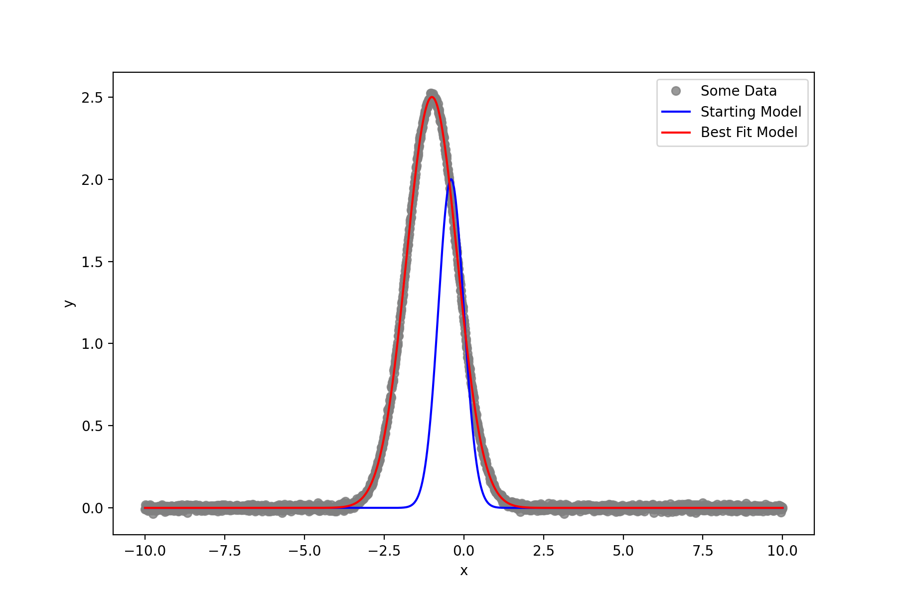

.. Optimize documentation master file, created by
   sphinx-quickstart on Sat May 30 15:42:33 2020.
   You can adapt this file completely to your liking, but it should at least
   contain the root `toctree` directive.

Tutorials
=========

Example 1: Fitting a Gaussian
+++++++++++++++++++++++++++++

.. literalinclude:: ../examples/gauss_fit_example.py
    :language: python

The result ...

Indices and tables
==================

* :ref:`genindex`
* :ref:`modindex`
* :ref:`search`
